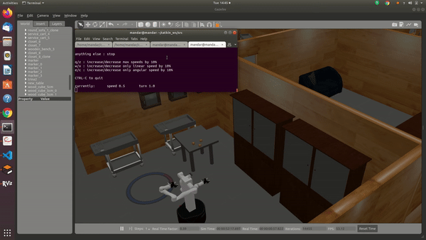

# WPI-Research-HiRo-lab

Augmenting manipulation using locomotion.

The navigate_2_optimal position should be saved under TRINA 2.0 WPI folder of TRINA 2.0  ROS repository.
Running the optimal_position.py file will give the optimal_position the robot needs to reach for given object or set of objects to be manipulated, 
ensuring maximum reachability and manipulability.
A simple Move_base to goal file can be used to to give this optimal position and the robot will travel using Move_base.

